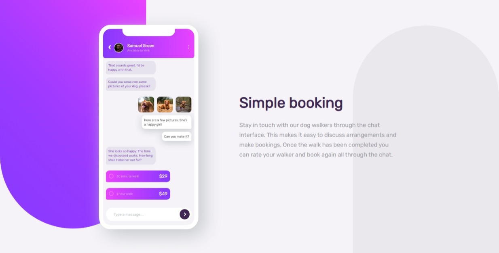
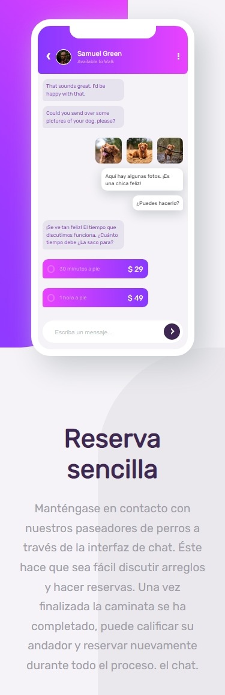

# Chat app Illustration

This is a solution to the [Chat app CSS illustration challenge on Frontend Mentor](https://www.frontendmentor.io/challenges/chat-app-css-illustration-O5auMkFqY). Frontend Mentor challenges help you improve your coding skills by building realistic projects.

## Table of contents

- [Overview](#overview)
  - [The challenge](#the-challenge)
  - [Screenshot](#screenshot)
  - [Links](#links)
- [My process](#my-process)
  - [Built with](#built-with)
- [Author](#author)

## Overview

### The challenge

Users should be able to:

- View the optimal layout for the component depending on their device's screen size
- See the chat interface animate on the initial load

### Screenshot

### Links

- Solution URL: [Github solution](https://github.com/DF27ARTS/Chat_App_Illustration_Mentor_Challenge/)
- Live Site URL: [Live site](https://df27arts.github.io/Chat_App_Illustration_Mentor_Challenge/)

## My process

### Built with

- Semantic HTML5 markup
- CSS custom properties
- Flexbox
- CSS Grid
- SASS Preprocessor

## Author

- Website - [Fernando Rojas](https://portfoliio-three.vercel.app/)
- Frontend Mentor - [@DF27ARTS](https://www.frontendmentor.io/profile/DF27ARTS)
- Twitter - [@\_DF_Fernando](https://twitter.com/_DF_Fernando)
